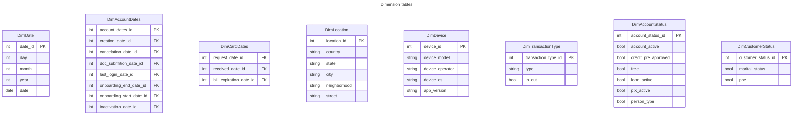

# Problem description

- Model visualy using a MER diagram the desired database adressing all the performance and consistency issues;
- Control the code versioning to keep track of changes;
- Implement the model and construct the data warehouse using SQL.

# Modeling design choices

Before modeling the database some decisions regarding its architecture must be made. The first is the schema used, the schema defines how the tables are related to each other.

In our case, as the most complex problem to be solved is consistency, I chose to use the snowflake schema. When modeling using the snowflake schema, the dimension tables are normalized in such a way that there is no redundant data that causes this consistency problem.

In addition, even if the snowflake schema ends up needing more complex queries and, consequently, with a longer execution time, the fact that the large table is reduced to small tables will make the execution of the queries faster.

Finally, the other reason I chose this schema over the star schema is that databases using the snowflake schema tend to take up less space, which is critical given the current size of the aforementioned table.

# Modeling the database

To model the database I will follow 5 basic steps described bellow:

- [Identify entities and attributes](#entities-and-attributes): the first thing to do is to know your data. In this step I will study the column names, try to aggregate them as attributes of various entities.
- [Create the fact tables](#fact-table-creation): after knowing the data, decide which metrics are important to the business, thus creating the columns of the fact table.
- [Create the dimension tables](#dimension-tables-creation): the dimension tables are auxiliray tables that contains descriptive attributes of the data, create those tables is the next step.
- Normalize dimension tables: in the snowflake schema the dimension tables are normalized to avoid redundancy and improve performance
- Create the relation between tables: relate the fact and dimension tables, also create the relationship between the dimension tables and its helper tables. This process is made by adding primary and foreign keys.

## Entities and attributes
The first thing to do is divide the data into categories. The division is arbitrary, in this case I created four categories:

- Account: account attributes for example client type, number of spaces, password, status, etc.
- Card: every card related attribute such as number of virtual cards, cards last digits, card 
color, etc.
- Person: attributes related to a person like cellphone characteristics, location, contact info, etc.
- Transaction: dates of any type of transaction - debit or credit card, pix, digital wallets.

## Fact table creation:
Observing the given column names, it is possible to verify that there is not a column that reports a fact in itself. This way I had two options: create new columns for facts, or build a fact table based on events. The decidision to use a event based approach was chosen at first, but was discarded. So I created some new columns to use as facts. 

The first created fact table is about transactions. Every transaction store its value, date, location and type. 

The second one is about accounts. It stores various boolean values about ana account like if it is free or payed, active or not, have an active loan or not, and some personal info.

The third one is a customer fact that will store personal information of customer.

The last fact table is about cards. It stores thing like the number of cards an account have, the limit of the card, the color, request and received date, etc.

## Dimension tables creation:
The dimension tables are created based on the fact tables foreign keys. Considreing that we need 8 different dimensions.

Combining these two diagrams we can see the snowflake form. ALthough transaction, customer and card facts references directly the date dimension, the account and card facts references it indirectly using another dimension table.

# References

[Tutorialspoint: Data Warehousing - Schemas](https://www.tutorialspoint.com/dwh/dwh_schemas.htm)

[Vertabelo: Star Schema vs. Snowflake Schema](https://vertabelo.com/blog/data-warehouse-modeling-star-schema-vs-snowflake-schema/)

[Software Tersting Help: Schema Types In Data Warehouse Modeling – Star & SnowFlake Schema](https://www.softwaretestinghelp.com/data-warehouse-modeling-star-schema-snowflake-schema/#Which_Is_Better_Snowflake_Schema_Or_Star_Schema)

[Bigbear.AI: Factless Fact Tables](https://bigbear.ai/blog/factless-fact-tables/)